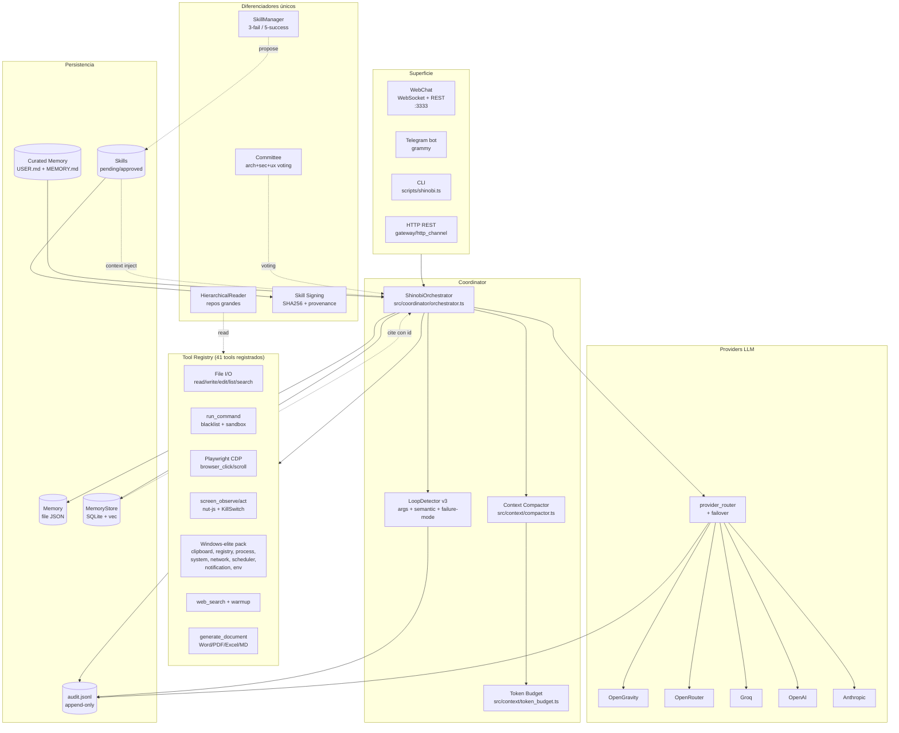

# Architecture

Shinobi es un agente autónomo **Windows-native**. No es un wrapper de chat ni
un framework genérico: ejecuta acciones reales sobre la máquina del usuario
con guardrails diseñados para que el LLM no entre en bucles destructivos.

Esta página describe la arquitectura a 2026-05-14. Para detalles de cada
módulo, ver el código (los paths están en cada sección).

---

## Vista general

---

## Flujo de una petición

1. **Entrada** llega por WebChat (`src/web/server.ts`), Telegram
   (`src/gateway/telegram_channel.ts`), HTTP (`src/gateway/http_channel.ts`) o
   CLI (`scripts/shinobi.ts`).
2. **`ShinobiOrchestrator.process(input)`** (`src/coordinator/orchestrator.ts`):
   1. `memory.addMessage` registra el input.
   2. `contextBuilder.buildMessages` ensambla system prompt + curated snapshot
      (`USER.md`, `MEMORY.md`) + historial saneado.
   3. `MemoryStore.buildContextSection` inyecta memorias relevantes con
      citations (`[memory:<id> score=… cat=… match=…]`).
   4. `skillManager.getContextSection` inyecta skills aprobadas que matchean
      por `trigger_keywords`.
3. **Loop LLM-tool** (máx 10 iteraciones):
   1. `compactMessages` comprime el contexto si supera el 75% del budget.
      Trunca tool outputs largos, colapsa turnos antiguos en summary.
      Invariantes: system, último user input y últimos 3 turnos intactos.
   2. `tokenBudget().recordTurn` actualiza el snapshot (expuesto en
      `GET /api/token-budget`).
   3. `provider_router.invokeLLM` recorre la cadena de failover. Si el
      provider falla con rate_limit/transient/auth/unknown → rota al
      siguiente con log visible `[Shinobi] Provider switched: groq → openai
      (rate limit)`. Solo `fatal_payload` corta la cadena.
   4. Para cada `tool_call`:
      - `LoopDetector.recordCallAttempt` (capa args, SHA256). 2º intento
        idéntico → abort con `LOOP_DETECTED`.
      - `tool.execute(args)`.
      - `audit_log.logToolCall` registra `{ts, tool, argsHash, success,
        durationMs, error}` en `audit.jsonl`.
      - `LoopDetector.recordCallResult` (capa semántica). 3 outputs
        indistinguibles para misma tool → abort con `LOOP_NO_PROGRESS`.
4. **Salida** se persiste en `memory.json` y se envía al canal de origen.

---

## Módulos clave

| Módulo | Path | Función |
|--------|------|---------|
| Orchestrator | `src/coordinator/orchestrator.ts` | Loop LLM-tool, modos local/kernel/auto |
| Loop detector v2 | `src/coordinator/loop_detector.ts` | Capa args + capa semántica |
| Compactor | `src/context/compactor.ts` | Reducción de tokens preservando invariantes |
| Token budget | `src/context/token_budget.ts` | Tracker per-session + endpoint REST |
| Provider router | `src/providers/provider_router.ts` | Failover cross-provider |
| Failover policy | `src/providers/failover.ts` | Clasificador de errores |
| Tool registry | `src/tools/tool_registry.ts` | Singleton in-process |
| run_command guards | `src/tools/run_command.ts` | Blacklist destructiva + sandbox |
| Windows-elite tools | `src/tools/{clipboard,process,system,disk,env,network,registry,task_scheduler,windows_notification}_*` | 10 tools nativos vía PowerShell |
| Audit log | `src/audit/audit_log.ts` | JSONL append-only de tool_call, loop_abort, failover |
| Skill signing | `src/skills/skill_signing.ts` | SHA256 + provenance, detección de tampering |
| Memory citations | `src/memory/memory_citations.ts` | Formato con id, score, match type |
| Committee | `src/committee/Committee.ts` | Multi-modelo voting (arch+sec+ux) |
| Hierarchical reader | `src/reader/HierarchicalReader.ts` | Análisis jerárquico de repos grandes |

---

## Decisiones de diseño

### Heurístico antes que LLM

El compactor y el loop detector v3 son **100% heurísticos**. Podrían usar un
LLM para summarization semántica o detección de "non-progress" más fina, pero
eso añade latencia, coste y un punto de fallo más. La regla `chars/4` y el
fingerprint con timestamps/paths normalizados cubren el 95% del valor con 0%
del riesgo.

### Cero dependencias para tools Windows

Las 10 tools del pack Windows-elite usan `powershell.exe` y `schtasks.exe`
nativos. No requieren instalar `BurntToast`, `WMI module`, ni nada. Eso
mantiene el `.exe` empaquetado bajo control y reduce la superficie de
vulnerabilidades supply-chain.

### Audit best-effort

`audit.jsonl` jamás bloquea el flujo. Si el path no es escribible, devuelve
`false` y el agente continúa. Esto importa porque el audit no debe ser un
punto único de fallo para el usuario.

### Sin PKI para skills

Las skills se firman con SHA256 del contenido canonicalizado + `signed_by` +
`signed_at`. No es una clave privada del autor — es un checksum + provenance.
Suficiente para detectar tampering del SKILL.md fuera del flujo, sin la
complejidad de gestionar claves.

---

## Contraste con la competencia

| Capacidad | Hermes | OpenClaw | Shinobi |
|-----------|--------|----------|---------|
| Loop detector | ❌ | ❌ | ✅ v2 (args + semántico) |
| Failover cross-provider | parcial (credential pool) | ✅ | ✅ con clasificación |
| Context compaction | ✅ LLM-based | ✅ heurístico | ✅ heurístico, idempotente |
| Multi-canal | 15+ | 20+ | 4 (Web/Telegram/HTTP/CLI) |
| Token budget visible | ❌ | ❌ | ✅ `/api/token-budget` |
| Audit log unificado | parcial (Skills Guard solo) | parcial (sandbox-info) | ✅ todo en `audit.jsonl` |
| Skill provenance | ❌ (auto-archive sin confirm) | n/a | ✅ SHA256 + signed_by |
| Memory citations | ❌ | opt-in | ✅ default con id |
| Windows-native | cross-platform | cross-platform | ✅ 10 tools nativos |
| Committee voting | ❌ | ❌ | ✅ arch+sec+ux |
| Hierarchical reader | ❌ | ❌ | ✅ |
| LOC monolítico | `run_agent.py` 15k | `plugin-sdk` 100+ exports | modular por bloques |

---

## Endurecimiento de la capa de ejecución (2026-06-10)

Cinco arreglos a la fontanería del bucle agéntico, hallados midiendo misiones
reales contra el agente vivo y verificados en vivo:

- **Normalización de model-ID por proveedor** (`src/providers/model_id.ts`).
  El failover pasaba el model-ID crudo a cualquier cliente donde cayera; un
  override estilo OpenRouter (`openai/gpt-4o`) llegaba al cliente directo de
  OpenAI y daba "invalid model ID". `normalizeModelId()` quita el prefijo propio
  y degrada al default del proveedor si el prefijo es ajeno. Los clientes
  directos (openai/groq/anthropic) la usan; OpenRouter no (sus IDs sí van
  prefijados).
- **Adaptador Anthropic con `tool_calls`** (`src/providers/anthropic_client.ts`).
  Un mensaje `assistant` con `tool_calls` en formato OpenAI hacía que Anthropic
  rechazara la petición ("Extra inputs are not permitted"). `splitSystemAndMessages`
  ahora traduce ese mensaje a bloques de contenido nativos (`tool_use`) y limpia
  los campos OpenAI-only (`refusal`, `annotations`) que Groq también rechazaba
  (`sanitizeOpenAiMessages`). Resultado medido: Anthropic pasó de fallar siempre
  a servir como fallback real.
- **Contexto por conversación** (`src/coordinator/orchestrator.ts` +
  `src/db/context_builder.ts`). El historial del agente era un singleton global
  de sesión; una misión nueva arrastraba el contexto de la anterior (un "ping"
  pedía ~30k tokens y reventaba el TPM de los proveedores). `setConversation(id)`
  da a cada conversación su propio `memory-conv-<id>.json` persistente; el WebChat
  lo invoca por conversación. Medido: 30k → 14k tokens en conversación nueva.
- **Loop detector consciente del resultado** (`src/coordinator/loop_detector.ts`,
  capa 1). Antes abortaba al 2º intento con args idénticos, matando ciclos
  legítimos de editar-y-reejecutar o refinar-búsqueda. Ahora aborta solo cuando
  los MISMOS args producen el MISMO resultado N veces (racha sin progreso), con
  un tope duro de seguridad; si el resultado varía (el agente cambió el mundo),
  deja progresar. La ruta "ciega" sin resultados conserva el comportamiento
  original (tests intactos).
- **`browser_observe` arreglado** (`src/browser/observer.ts`, `session.ts`). El
  bundler (esbuild/tsup keepNames) envolvía las funciones nombradas serializadas
  a la página en `__name(...)`, helper inexistente en el contexto del navegador
  → `ReferenceError`. Se inyecta un `__name` identidad antes del `page.evaluate`
  y en `addInitScript` de la sesión. El mapa de elementos interactivos (base para
  rellenar formularios y pulsar) vuelve a funcionar.

## Lo que NO está hecho (deuda conocida)

- `src/memory/memory_store.ts` y `src/persistence/missions_recurrent.ts` tienen
  errores `Cannot find namespace 'Database'` por usar `better-sqlite3` sin la
  declaración de namespace. Funciona en runtime; tsc lo señala. CI filtra
  esos 4 errores pre-existentes y los aborda por separado.
- Las 18 specs `*.test.ts` pre-existentes están en estilo `main().catch(...)`
  en vez de vitest. Se van portando bloque a bloque; vitest las excluye del
  include hasta entonces.
- Persistent missions / cron están a medias (`src/runtime/resident_loop.ts`).
  Tier A #12 las completa.
- No hay sandboxing OS real para `run_command` — solo blacklist + sandbox de
  cwd. Tier A #13 añade un backend Docker opcional.
