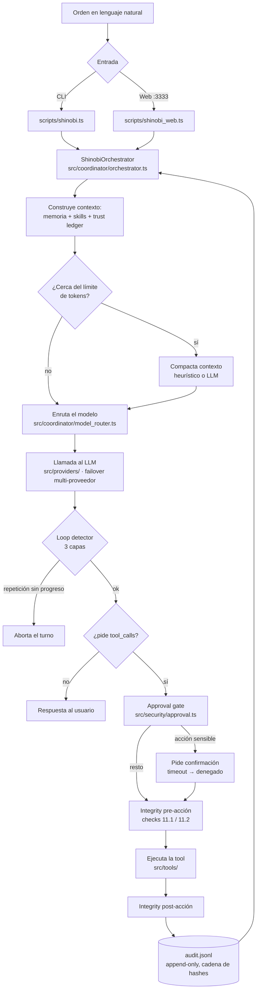

# Shinobi

[](../../actions/workflows/ci.yml)

Agente autónomo Windows-nativo. Recibe una orden en lenguaje natural y la ejecuta
con acciones reales sobre la máquina: sistema de archivos, shell (PowerShell,
Node, Python), un navegador Chrome real por CDP, y sub-agentes en paralelo. Cada
tool-call queda registrada en un log append-only (`audit.jsonl`).

Se opera desde una CLI (`scripts/shinobi.ts`) o desde una interfaz web local
(`scripts/shinobi_web.ts`, puerto 3333).

## Qué problema resuelve

Automatizar tareas de escritorio y de código que hoy requieren encadenar a mano
varias herramientas: leer y transformar ficheros, conducir un navegador con la
sesión del usuario ya iniciada, correr y depurar scripts, y auditar un
repositorio. Todo se ejecuta en local, contra las cuentas y credenciales del
propio usuario; nada se delega a un servicio remoto salvo las llamadas al modelo
de lenguaje, que son multi-proveedor con failover (`src/providers/`).

Un gate de aprobación (`src/security/approval.ts`) intercepta las acciones
sensibles —secretos, gasto, borrado irreversible, primer acceso del navegador a
un host nuevo— y pide confirmación; el resto se ejecuta sin interrumpir.

## Recorrido de una petición



## Requisitos

- Windows 10 u 11
- Node.js 22 o superior
- Al menos una API key de un proveedor de LLM (OpenAI, Anthropic, Groq u
  OpenRouter), o un endpoint local compatible con la API de OpenAI (Ollama,
  LM Studio, llama.cpp)
- Opcional, para las tools de navegador en runtime: Chrome arrancado con
  `--remote-debugging-port=9222`
- Opcional, para STT local (`src/stt/`): el binario `whisper-cli` de whisper.cpp
  en el `PATH` o en `SHINOBI_WHISPERCPP_BIN`, más un modelo `ggml-*.bin` en
  `SHINOBI_WHISPERCPP_MODEL`. El repo no incluye binarios de whisper.

## Instalación desde cero

```bash
git clone <url-del-repositorio> shinobi
cd shinobi
npm install
cp .env.example .env
```

Edita `.env` y define al menos una clave de proveedor (`OPENAI_API_KEY`,
`ANTHROPIC_API_KEY`, `GROQ_API_KEY` o `OPENROUTER_API_KEY`). El resto de
variables de `.env.example` son opcionales y tienen valores por defecto; los
canales (Telegram, Discord, Slack, email) solo arrancan si todas sus variables
están definidas.

Opcional — habilita los E2E de navegador (`src/browser/__tests__/`), que si no se
saltan:

```bash
npx playwright install chromium
```

## Arranque

```bash
npm run start     # CLI interactiva
npm run dev       # interfaz web en http://localhost:3333
npm run tui       # interfaz de terminal (Ink)
```

Los lanzadores `.cmd` equivalentes están en `lanzadores/`.

Binario portable:

```bash
npm run build:exe   # genera build/Shinobi.exe y build/Shinobi-Setup.exe
```

## Comandos disponibles

```
npm run start           tsx scripts/shinobi.ts        (CLI)
npm run dev             tsx scripts/shinobi_web.ts    (web :3333)
npm run tui             tsx scripts/shinobi-tui.tsx
npm run test            vitest run
npm run test:watch      vitest
npm run test:coverage   vitest run --coverage
npm run typecheck       tsc --noEmit
npm run build:exe       tsx scripts/build_exe.ts
npm run sbom            tsx scripts/gen_sbom.ts
npm run verify:receipt  tsx scripts/verify_receipt.ts
npm run policy:simulate tsx scripts/policy_simulate.ts
npm run bench           tsx scripts/benchmarks/run.ts
npm run bench:compare   tsx scripts/bench.ts
npm run bench:agentic   tsx scripts/bench_s_agentic.ts
npm run bench:s_code    tsx scripts/bench_s_code.ts
npm run bench:g2 · g4 · g5 · f41 · f43   suites de benchmark individuales
```

Los comandos de operador dentro de la CLI/web (prefijo `/`) se definen en
`src/coordinator/slash_commands.ts` (`/read`, `/skill`, `/memory`, `/committee`,
`/learn`, `/resident`, `/ledger`, `/approval`, `/model`, entre otros).

## Estructura del repositorio

```
src/                  código del producto y sus tests, por submódulo
  coordinator/        orquestador del bucle LLM-tool (orchestrator.ts)
  tools/              62 herramientas nativas (fs, shell, navegador, sistema)
  providers/          clientes LLM multi-proveedor con failover
  security/           gate de aprobación selectivo
  integrity/          checks pre/post-acción y artefactos certificados
  browser/            subsistema de navegador "Kage" (observe → act → verify)
  memory/             memoria persistente curada
  skills/             gestor de skills firmadas (SHA256 + procedencia)
  agents/             sub-agentes especialistas (swarm/team)
  audit/              log append-only de tool-calls
  ...                 (a2a, attest, channels, gateway, runtime, sandbox, sentinel,
                       stt, tenshu, tui, web, …)
scripts/              puntos de entrada y utilidades (shinobi.ts, shinobi_web.ts,
                      build_exe.ts, gen_sbom.ts, gates f1/f2/f3, smokes d015/016/017)
skills/               librería de skills que se distribuye con el agente
lanzadores/           lanzadores .cmd para Windows
demos/                fixtures deterministas para `npm run bench:agentic`
docs/                 documentación de arquitectura y esquema de misión
config/               config versionada (config/sentinel/sources.yaml)
.github/workflows/    CI: ci.yml, gates.yml, issue_triage.yml, release.yml
```

Configuración en la raíz: `package.json`, `tsconfig.json`, `tsconfig.build.json`,
`vitest.config.ts`, `.env.example`, `pkg.config.json`, `bench.config.example.json`,
`Dockerfile.sandbox-browser`, `docker-compose.sandbox-browser.yml`.

## Tests

`npm run test` (vitest). 247 ficheros, 2312 tests recogidos. Medido hoy en un
clon limpio, tres ejecuciones seguidas con el mismo resultado y **0 fallos**:

```
sin  npx playwright install chromium :  2297 passed | 15 skipped (2312)
con  npx playwright install chromium :  2309 passed |  3 skipped (2312)
```

La diferencia son los 12 tests E2E de `src/browser/__tests__/kage_e2e.test.ts` y
`kage_g4.test.ts`: necesitan el Chromium de Playwright y, si falta, se **saltan
con un aviso explícito en consola** (`[kage_e2e] SKIP — …`) en vez de fallar. Los
3 `skipped` restantes son skips deliberados en el propio código.

`npm run typecheck` (`tsc --noEmit`) pasa sin errores.

## Licencia

ISC. Ver [LICENSE](LICENSE).
