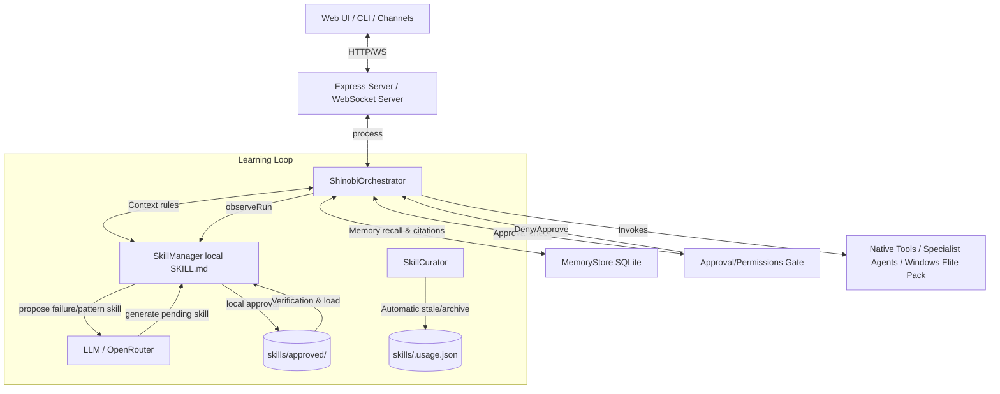

# ShinobiBot: Comprehensive Codebase & Architecture Audit

This document presents a detailed, read-only architectural audit and code map of **ShinobiBot**, a local-first agentic developer/creators assistant designed for Windows environments.

---

## 1. Executive Summary & System Overview

ShinobiBot is a highly modular, secure, and instrumented agentic assistant. It features:
- **Local-first execution** with optional fallback to the **OpenGravity Cloud Kernel**.
- **A multi-tiered safety sandbox** designed to prevent directory traversal and unauthorized writes, using a smart gate system that prompts the user dynamically.
- **A local skill-learning loop** that automatically identifies repetitive command patterns or consecutive failures, generating and cryptographically signing prompt skills.
- **Observability and instrumentation**, featuring a Prometheus-compatible metrics dashboard.
- **A state-of-the-art dual UI**: A public landing page (Zapweave) and a rich, PWA-ready local dashboard (Shinobi Dojo) with WebSocket streaming.



---

## 2. Core Architecture

### 2.1 The Execution Loop & Orchestrator
The orchestrator is implemented in [orchestrator.ts](file:///c:/Users/angel/Desktop/shinobibot/src/coordinator/orchestrator.ts). It drives the core agent loop, processing user requests by executing tool calls iteratively:
- **Context Construction**: Incorporates relevant semantic memories (via [memory_store.ts](file:///c:/Users/angel/Desktop/shinobibot/src/memory/memory_store.ts)) and active skills (via [skill_manager.ts](file:///c:/Users/angel/Desktop/shinobibot/src/skills/skill_manager.ts)).
- **Delegation Routing**: Inject directives prompting the LLM to delegate high-level complex tasks (e.g. search, document compilation, charts) to **Specialist Agents** (`research_agent_run`, `docs_agent_run`, `data_agent_run`).
- **Iteration Budget**: Controlled via an `IterationBudget` tracker (configurable, defaults to 20 for code implementation and 10 for other tasks) replacing hardcoded iteration caps.
- **Context Compactor**: Employs an heuristic context compactor ([compactor.ts](file:///c:/Users/angel/Desktop/shinobibot/src/context/compactor.ts)) and an optional LLM-driven semantic compactor ([llm_compactor.ts](file:///c:/Users/angel/Desktop/shinobibot/src/context/llm_compactor.ts)) to fit payloads within the provider's token budget limits.
- **Loop & Failure Detection**: Features a three-layered loop detector:
  1. **Args Layer**: Detects exact repetitive calls via argument hashing.
  2. **Semantic Output Layer**: Halts execution if a tool produces identical outputs over consecutive turns.
  3. **Environmental Failure Mode Layer**: Aborts execution if multiple tools repeatedly fail due to the same environmental issue (e.g., disconnected browser, missing API keys, dead network).

### 2.2 Security & Sandboxing
The safety controls are divided between [permissions.ts](file:///c:/Users/angel/Desktop/shinobibot/src/utils/permissions.ts) and [approval.ts](file:///c:/Users/angel/Desktop/shinobibot/src/security/approval.ts):
- **Path Validation**: Validates all reads/writes. Directory traversal is blocked using strict path relativity comparison (e.g., preventing sibling directory escapes like `C:\workspace-evil`).
- **Workspace Locking**: Modifying files outside the workspace root is blocked by default, unless explicitly approved by the user. If the user permits a write, it is logged in `sessionApprovedPaths` and unlocked *only* for that operations scope.
- **Absolute Prohibitions**: Sensitive directories (such as `C:\Windows\System32`, `/etc/shadow`, etc.) are hard-blocked and can *never* be unlocked, regardless of user approval.
- **Dynamic Approval modes**:
  - `on`: Prompts for every single write/execution tool call.
  - `smart` (default): Only prompts for destructive commands (e.g. `rm -rf`, `format`) or writes outside the workspace root.
  - `off`: Disables all checks and allows arbitrary command execution.

### 2.3 State & Memory Systems
The memory subsystem is found under `src/memory/`:
- **SQLite Storage**: Curated memories are stored in an SQLite database ([memory_store.ts](file:///c:/Users/angel/Desktop/shinobibot/src/memory/memory_store.ts)).
- **Markdown Sync**: The SQLite database functions as a queryable semantic cache derived from markdown files (`memory/USER.md` and `memory/MEMORY.md`). On system boot, the cache is automatically reindexed from these files.
- **Context Citations**: Retrieved memories are appended to the system message using a formal citation format detailing source ID, category, score, and match type ([memory_citations.ts](file:///c:/Users/angel/Desktop/shinobibot/src/memory/memory_citations.ts)):
  ```text
  - [memory:8f9a2b4c score=0.91 cat=general match=semantic] User prefers Outfit font family.
  ```

### 2.4 Skill Learning Loop
ShinobiBot implements a self-improving skill framework under `src/skills/` and `src/learning/`:
- **Trigger Detection**: During the post-task step, `SkillManager.observeRun()` parses the execution sequence.
  - *Failure Trigger*: If a prompt fails 3 times consecutively, a recovery skill is proposed.
  - *Pattern Trigger*: If a tool sequence succeeds 5 times, a shortcut skill is proposed.
- **Generation & Signing**: Skills are generated in the background as markdown instructions ([skill_manager.ts](file:///c:/Users/angel/Desktop/shinobibot/src/skills/skill_manager.ts)) and placed under `skills/pending/`. Once approved, they move to `skills/approved/` and are signed cryptographically ([skill_signing.ts](file:///c:/Users/angel/Desktop/shinobibot/src/skills/skill_signing.ts)) using a SHA-256 hash of their canonical parameters to prevent external tampering.
- **Skill Telemetry**: A sidecar database (`skills/.usage.json`) monitors use/view/patch counts for each skill ([skill_telemetry.ts](file:///c:/Users/angel/Desktop/shinobibot/src/learning/skill_telemetry.ts)).
- **The Skill Curator**: The `SkillCurator` ([skill_curator.ts](file:///c:/Users/angel/Desktop/shinobibot/src/learning/skill_curator.ts)) automatically transitions unused agent-created skills to `stale` (after 30 days) and `archived` (after 90 days). It also queries the LLM to cluster overlapping skills and writes consolidation advice to `REPORT.md` for human review.

---

## 3. The Tool Ecosystem

All tools register into a centralized hub ([tool_registry.ts](file:///c:/Users/angel/Desktop/shinobibot/src/tools/tool_registry.ts)).

### 3.1 Standard Web & Local Tools
- **Filesystem**: `read_file`, `write_file`, `edit_file`, `list_dir`, `search_files`.
- **Execution**: `run_command`.
- **Web Navigation & Extraction**: `web_search`, `web_search_with_warmup`, `clean_extract`, `browser_click`, `browser_scroll`, `browser_click_position`.
- **Integration**: `n8n_invoke`, `n8n_list_catalog`.

### 3.2 Specialist Agents
- `research_agent_run`: Performs deep, autonomous web investigations.
- `docs_agent_run`: Compiles technical documents, articles, or reports.
- `data_agent_run`: Analyzes datasets and outputs summary tables or visualizations.

### 3.3 Windows-Elite Tool Pack
To leverage Windows-native environments, ShinobiBot includes elite capabilities:
- **System Internals**: `process_list` (active processes), `system_info` (OS/hardware), `disk_usage`, `env_list` (environment variables), `network_info` (interfaces, ports).
- **Automation**: `clipboard_read`, `clipboard_write`, `task_scheduler_create` (registers persistent tasks), `windows_notification` (desktop notifications).
- **Multimedia**: `voice_speak` (TTS), `audio_transcribe` (transcribes local recordings).

---

## 4. The Dashboard & Front-End

ShinobiBot provides a unified HTTP layout serving three main layers:

### 4.1 Zapweave Landing Page
Served from [web/index.html](file:///c:/Users/angel/Desktop/shinobibot/web/index.html) (with matching Vanilla CSS). It showcases the marketing portal of Shinobi's creator-assistant persona ("Zapweave") including user benefits, workflow descriptions, and an email newsletter form.

### 4.2 Shinobi Dojo Chat Dashboard
The core interface is served from [index.html](file:///c:/Users/angel/Desktop/shinobibot/src/web/public/index.html) and wired via [app.js](file:///c:/Users/angel/Desktop/shinobibot/src/web/public/js/app.js):
- **Aesthetic Theme**: Employs a premium Japanese-inspired design ("Ensō" layout). Supports dynamic light (`hiru`) and dark (`yoru`) modes, including a custom SVG paper-noise overlay (`washi-noise`).
- **Interactive Messaging**: Supports real-time text typewriter reveals, custom folding panels for LLM thinking/reasoning blocks, live-updating pills for active tool executions, and a custom hanko seal (`忍`) stamped upon message completion.
- **Control Modals**: Prompts the user with dialog cards for intermediate actions (`ask` inputs) and security gates (`approval_request` buttons).
- **PWA Capabilities**: Fully ready for offline launch and installation on desktop/mobile browsers.

### 4.3 Administrator & Observability Dashboard
An isolated monitoring panel mounted at `/admin/` ([admin_dashboard.ts](file:///c:/Users/angel/Desktop/shinobibot/src/observability/admin_dashboard.ts)):
- **Real-time Metrics**: Renders live stats from a polling request to `/admin/metrics/json`. Shows Counters, Gauges, and Histograms ([metrics.ts](file:///c:/Users/angel/Desktop/shinobibot/src/observability/metrics.ts)) measuring execution counts, agent usage, token ratios, and loop durations.
- **Prometheus Export**: Exposes formatted logs at `/admin/metrics/prom` for metric aggregations.
- **Alert Status**: Lists all triggered health and resource alerts.

---

## 5. Execution Interfaces & Commands

### 5.1 CLI Launcher
Launched via `shinobi_start.cmd` or direct entry points, facilitating terminal-based conversations and command executions.

### 5.2 Express Server & Channels
The web interface is hosted by an Express instance ([server.ts](file:///c:/Users/angel/Desktop/shinobibot/src/web/server.ts)) on port `3333`.
- **Database Persistence**: Stores message feeds in a SQLite DB (`web_chat.db`) via the shared [chat_store.ts](file:///c:/Users/angel/Desktop/shinobibot/src/web/chat_store.ts) layer.
- **WebSocket Gateway**: Routes bidirectional traffic. Supports token monitoring, auto-offering documents when structured text outputs are detected, and auto-generating conversation titles on the third user interaction.
- **Anti-CSWSH Guard**: Rejects incoming WebSockets whose HTTP Origin header does not match the server's Host header.
- **Agent Discovery (A2A)**: Implements Agent-to-Agent discovery via `/.well-known/agent-card.json` and a rate-limited entry endpoint at `/a2a` ([a2a_wiring.js](file:///c:/Users/angel/Desktop/shinobibot/src/a2a/a2a_wiring.js)).
- **Integration Channels**: Incorporates automated webhook endpoints and Telegram channel event bridges ([channels_wiring.js](file:///c:/Users/angel/Desktop/shinobibot/src/channels/channels_wiring.js)).

### 5.3 Complete Slash Commands Reference
Users can control the agent interactively by prefixing input with `/`. These are resolved in [slash_commands.ts](file:///c:/Users/angel/Desktop/shinobibot/src/coordinator/slash_commands.ts):

| Command | Subcommands / Parameters | Description |
| :--- | :--- | :--- |
| `/status` | — | Checks the online state of the OpenGravity Cloud Kernel. |
| `/mode` | `local` \| `kernel` \| `auto` | Configures whether the agent runs locally or connects to the cloud. |
| `/model` | `[auto \| list \| <model_name>]` | Overrides or lists active LLMs (e.g. Claude 3.5 Sonnet, GPT-4o-mini). |
| `/approval` | `[on \| smart \| off]` | Sets the security permission level for destructive tools or out-of-workspace writes. |
| `/record` | `start` \| `stop` | Controls OBS screen/session recording (via composite skill). |
| `/replay` | — | Summarizes past run statistics from `audit.jsonl`. |
| `/memory` | `recall <query>` \| `store <text>` \| `stats` \| `forget <id>` \| `snapshot` | Queries or modifies the SQLite semantic memory store. |
| `/memory user` | `show` \| `edit "<section>" <text>` | Reads or edits user preferences inside `memory/USER.md`. |
| `/memory env` | `show` \| `append <text>` \| `propose <text>` \| `approve <idx>` \| `reject <idx>` | Controls environment-specific facts inside `memory/MEMORY.md`. |
| `/skill` | `list` \| `list-approved` \| `reload` \| `review` | Inspects, reloads, or reviews local prompts and executable skills. |
| `/skill` | `propose [<context>]` \| `approve <id>` \| `reject <id>` \| `install <name>` | Proposes, installs, or acts on pending skills. |
| `/resident` | `start` \| `stop` \| `status` \| `add "name" <secs> <prompt>` | Manages background automation cron loops. |
| `/resident` | `enable <id>` \| `disable <id>` \| `delete <id>` \| `reset <id>` \| `logs <id>` | Controls or views individual background tasks. |
| `/notify` | `set <workflow_id>` \| `unset` \| `test` | Configures external push notification triggers (via n8n). |
| `/read` | `<path> [--budget=N] [--deep] [--query=...]` | Invokes the hierarchical folder/file structure reader. |
| `/learn` | `<path_or_url>` | Parses a file or URL to extract and store knowledge. |
| `/ledger` | `verify` \| `export` | Asserts cryptographic integrity of the agent's ledger log. |
| `/self` | `[--diff] [--budget=N]` | Runs a self-diagnostic audit report of the active workspace. |
| `/improvements`| `[<report.json>]` | Lists recommended system/code modifications. |
| `/apply` | `<proposal_id>` | Interactively prompts the user to apply a code modification suggestion. |
| `/committee` | `[<report.json>]` | Executes a multi-model vote on code changes. |
| `/doc` | `<word \| pdf \| excel \| markdown \| auto> <instructions>`| Generates document assets based on instruction. |
| `/sentinel` | `watch` \| `ask` \| `deep` \| `list` \| `forward` \| `digest` | Manages technological search sentinel queries. |
